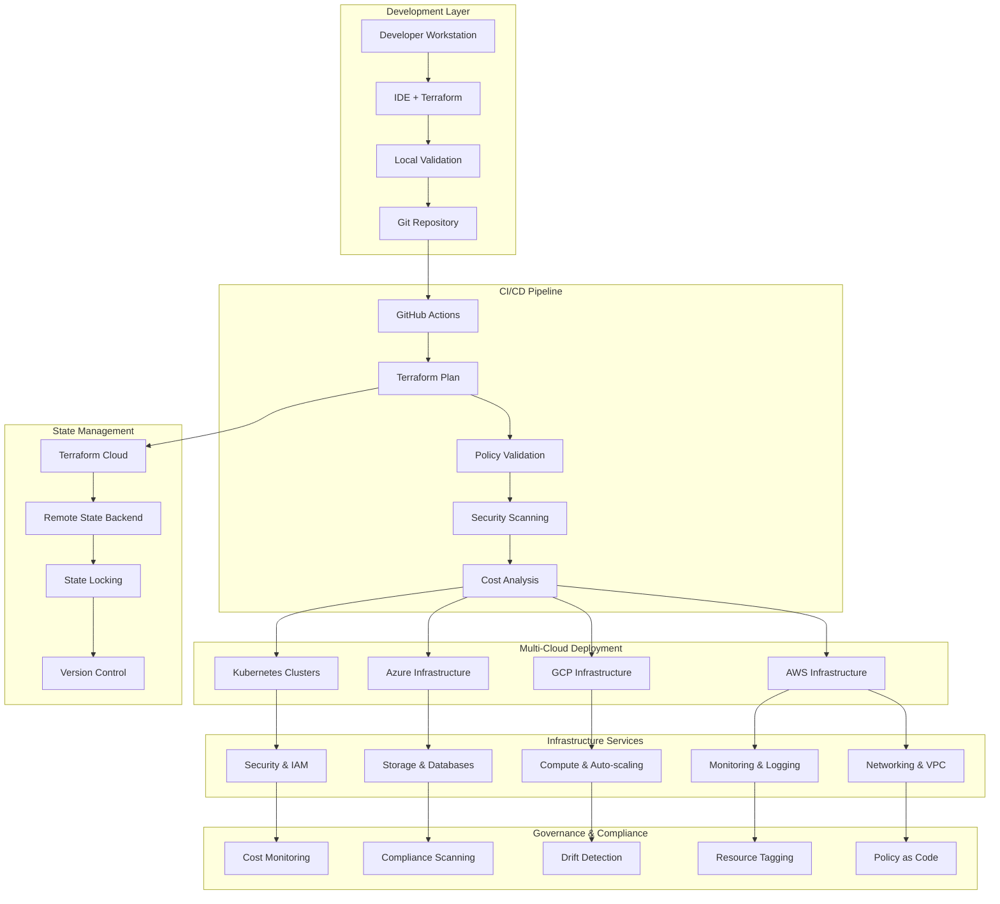
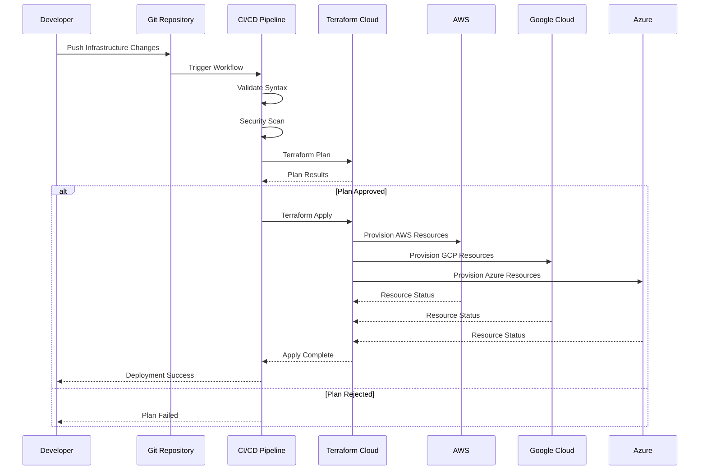
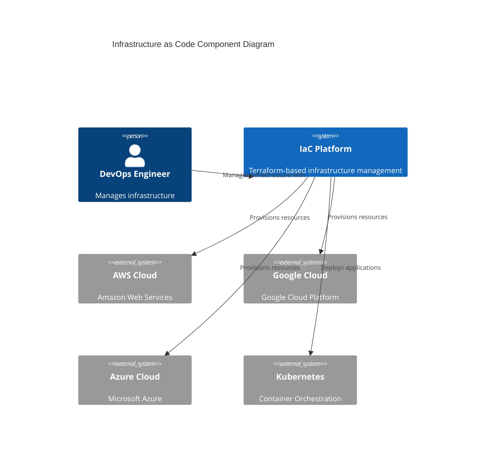

# Infrastructure as Code (IaC) Platform

[](https://www.terraform.io/)
[](https://aws.amazon.com/)
[](https://cloud.google.com/)
[](https://azure.microsoft.com/)
[](https://kubernetes.io/)
[](https://opensource.org/licenses/MIT)

A comprehensive Infrastructure as Code platform demonstrating SRE best practices for cloud infrastructure provisioning, management, and governance across multiple cloud providers.

## 📋 Table of Contents
- [🏗️ Architecture](#%EF%B8%8F-architecture)
- [🚀 Features](#-features)
- [📁 Project Structure](#-project-structure)
- [🛠️ Technology Stack](#%EF%B8%8F-technology-stack)
- [🚀 Quick Start](#-quick-start)
- [🏗️ Multi-Cloud Examples](#%EF%B8%8F-multi-cloud-examples)
- [🔒 Security](#-security-considerations)
- [💰 Cost Optimization](#-cost-optimization)
- [🤝 Contributing](#-contributing)

## 🏗️ Architecture

### Multi-Cloud Infrastructure Architecture


### Terraform Workflow


### Infrastructure Component Diagram


## 🚀 Features

### Multi-Cloud Support
- **AWS**: Complete EKS cluster, VPC, RDS, S3, IAM
- **Google Cloud**: GKE cluster, VPC, Cloud SQL, GCS
- **Azure**: AKS cluster, Virtual Network, SQL Database
- **Kubernetes**: Platform-agnostic K8s resources

### Infrastructure Components
- **Networking**: VPC/VNet, subnets, security groups, load balancers
- **Compute**: Auto-scaling groups, managed instance groups
- **Storage**: Object storage, databases, persistent volumes
- **Security**: IAM roles, policies, secrets management
- **Monitoring**: CloudWatch, Stackdriver, Azure Monitor integration

### SRE Best Practices
- **GitOps Workflow**: Infrastructure changes via Git
- **Environment Promotion**: Dev → Staging → Production
- **State Management**: Remote state with locking
- **Security Scanning**: Policy validation and compliance
- **Cost Optimization**: Resource tagging and cost analysis
- **Disaster Recovery**: Backup strategies and failover

### DevOps Integration
- **CI/CD Pipelines**: GitHub Actions, GitLab CI, Jenkins
- **Testing**: Infrastructure tests with Terratest
- **Documentation**: Auto-generated architecture diagrams
- **Secrets Management**: Vault, AWS Secrets Manager, Azure Key Vault

## 📁 Project Structure

```
infrastructure-as-code/
├── environments/
│   ├── dev/                    # Development environment
│   ├── staging/                # Staging environment
│   └── production/             # Production environment
├── modules/
│   ├── aws/                    # AWS-specific modules
│   ├── gcp/                    # GCP-specific modules
│   ├── azure/                  # Azure-specific modules
│   └── kubernetes/             # K8s-specific modules
├── policies/
│   ├── security/               # Security policies
│   ├── cost/                   # Cost optimization policies
│   └── compliance/             # Compliance rules
├── scripts/
│   ├── setup/                  # Environment setup scripts
│   ├── validation/             # Validation scripts
│   └── utilities/              # Utility scripts
├── tests/
│   ├── unit/                   # Unit tests for modules
│   └── integration/            # Integration tests
├── .github/
│   └── workflows/              # CI/CD workflows
└── docs/
    ├── architecture/           # Architecture documentation
    └── runbooks/               # Operational runbooks
```

## 🛠️ Technology Stack

- **Infrastructure as Code**: Terraform, Terragrunt
- **Policy as Code**: Open Policy Agent (OPA), Sentinel
- **Testing**: Terratest, InSpec, Kitchen-Terraform
- **CI/CD**: GitHub Actions, GitLab CI, Jenkins
- **State Backend**: Terraform Cloud, S3 + DynamoDB, GCS
- **Security**: Checkov, tfsec, Terrascan
- **Documentation**: Terraform-docs, Draw.io

## 🚀 Quick Start

### Prerequisites

```bash
# Install required tools
terraform --version    # >= 1.0
terragrunt --version   # >= 0.35
kubectl version        # >= 1.20
aws --version          # >= 2.0
gcloud version         # >= 350.0
az --version           # >= 2.30
```

### 1. Environment Setup

```bash
# Clone the repository
git clone <repo-url>
cd infrastructure-as-code

# Set up environment variables
cp .env.example .env
# Edit .env with your credentials

# Initialize Terraform
make init-dev
```

### 2. Deploy Development Environment

```bash
# Plan infrastructure changes
make plan-dev

# Apply changes
make apply-dev

# Verify deployment
make test-dev
```

### 3. Promote to Staging/Production

```bash
# Staging deployment
make promote-staging

# Production deployment (requires approval)
make promote-production
```

## 📊 Infrastructure Monitoring

### Drift Detection
```bash
# Check for configuration drift
make drift-detection

# Generate drift report
make drift-report
```

### Cost Analysis
```bash
# Generate cost report
make cost-analysis

# Resource optimization recommendations
make optimize-resources
```

### Compliance Scanning
```bash
# Run security scans
make security-scan

# Check compliance
make compliance-check
```

## 🔧 Available Commands

```bash
# Environment Management
make init-{env}         # Initialize environment
make plan-{env}         # Plan changes
make apply-{env}        # Apply changes
make destroy-{env}      # Destroy environment

# Testing
make test-unit          # Run unit tests
make test-integration   # Run integration tests
make test-all           # Run all tests

# Validation
make validate           # Validate configuration
make format             # Format code
make lint              # Lint configuration

# Documentation
make docs              # Generate documentation
make diagram           # Generate architecture diagrams

# Security
make security-scan     # Run security scans
make policy-check      # Check policies
```

## 🏗️ Multi-Cloud Deployment Examples

### AWS EKS Cluster
```hcl
module "eks_cluster" {
  source = "./modules/aws/eks"
  
  cluster_name    = "production-eks"
  cluster_version = "1.24"
  
  vpc_id     = module.vpc.vpc_id
  subnet_ids = module.vpc.private_subnets
  
  node_groups = {
    main = {
      instance_types = ["m5.large"]
      min_size       = 2
      max_size       = 10
      desired_size   = 3
    }
  }
  
  tags = local.common_tags
}
```

### GCP GKE Cluster
```hcl
module "gke_cluster" {
  source = "./modules/gcp/gke"
  
  name               = "production-gke"
  location           = "us-central1"
  initial_node_count = 3
  
  node_config = {
    machine_type = "n1-standard-2"
    disk_size_gb = 100
    preemptible  = false
  }
  
  labels = local.common_labels
}
```

## 📚 Documentation

- [AWS Infrastructure Guide](docs/aws/README.md)
- [GCP Infrastructure Guide](docs/gcp/README.md)
- [Azure Infrastructure Guide](docs/azure/README.md)
- [Kubernetes Guide](docs/kubernetes/README.md)
- [Security Best Practices](docs/security/README.md)
- [Cost Optimization](docs/cost/README.md)
- [Troubleshooting Guide](docs/troubleshooting/README.md)

## 🔒 Security Considerations

- **Least Privilege**: IAM roles with minimal permissions
- **Encryption**: Data encrypted at rest and in transit
- **Network Security**: Private subnets, security groups
- **Secrets Management**: No hardcoded secrets
- **Audit Logging**: CloudTrail, Cloud Audit Logs enabled
- **Compliance**: SOC2, HIPAA, PCI-DSS ready configurations

## 💰 Cost Optimization

- **Resource Tagging**: Consistent tagging for cost allocation
- **Right-sizing**: Automated recommendations
- **Reserved Instances**: Cost optimization strategies
- **Spot Instances**: Development environment cost reduction
- **Lifecycle Policies**: Automated resource cleanup

## 🤝 Contributing

1. Fork the repository
2. Create a feature branch
3. Make changes following our standards
4. Run tests and validation
5. Submit a pull request

## 📄 License

This project is licensed under the MIT License - see the [LICENSE](LICENSE) file for details.

## 📞 Support

- **Issues**: GitHub Issues
- **Discussions**: GitHub Discussions
- **Documentation**: [Wiki](../../wiki)
- **Runbooks**: [docs/runbooks/](docs/runbooks/)

---

**Created by [olaitanojo](https://github.com/olaitanojo)**
